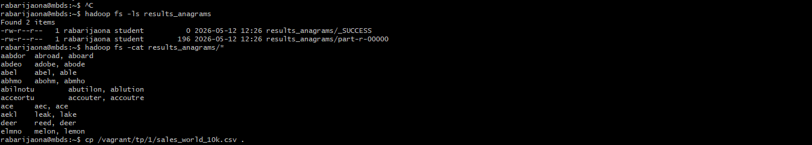

# README – Exercice 2 : Anagrams avec Hadoop

## Objectifs
- Détecter les mots qui sont des **anagrammes** dans une liste de mots anglais.  
- Écrire un programme MapReduce (Java ou Hadoop Streaming) pour résoudre le problème.  
- Utiliser Hadoop pour exécuter le job sur le fichier `common_words_en_subset.txt`.  
- Vérifier les résultats dans HDFS.

---

## Étapes détaillées

### 1. Récupération du fichier d’entrée (sur la VM)
Dans ton compte `rabarijaona` sur la VM :
```bash
cp /vagrant/tp/1/common_words_en_subset.txt .
ls -l common_words_en_subset.txt
```
-> Le fichier est maintenant dans ton **home directory** `/home/rabarijaona`.

---

### 2. Mise en HDFS du fichier
Toujours sur la VM :
```bash
hadoop fs -put common_words_en_subset.txt .
hadoop fs -ls
```
-> Le fichier est copié dans HDFS, prêt à être utilisé comme input.

---

### 3. Création du projet Java (sur le PC)
Sur ton PC, dans Git Bash :
```bash
mvn archetype:generate -DgroupId=org.mbds -DartifactId=anagrams -DarchetypeArtifactId=maven-archetype-quickstart -DinteractiveMode=false
```
->  Cela crée un projet Maven standard.  
Ensuite, on ajoute les dépendances Hadoop dans `pom.xml` et on crée les classes :
- `AnagramMapper.java`
- `AnagramReducer.java`
- `AnagramDriver.java`

---

### 4. Compilation du projet
Toujours sur le PC :
```bash
mvn package
```
-> Cela génère `target/anagrams-1.0-SNAPSHOT.jar`.

---

### 5. Transfert du `.jar` vers la VM
Sur le PC :
```bash
scp target/anagrams-1.0-SNAPSHOT.jar rabarijaona@spark.aiaoma.com:~
```
-> Le `.jar` est envoyé dans ton **home directory sur la VM**.

---

### 6. Exécution du job Hadoop (sur la VM)
Dans `/home/rabarijaona` :
```bash
hadoop jar anagrams-1.0-SNAPSHOT.jar org.mbds.AnagramDriver common_words_en_subset.txt results_anagrams
```

-> Si le dossier `results_anagrams` existe déjà, supprime-le avant :
```bash
hadoop fs -rm -r results_anagrams
```

---

### 7. Vérification des résultats
Toujours sur la VM :
```bash
hadoop fs -ls results_anagrams
hadoop fs -cat results_anagrams/*
```

-> On verras les groupes d’anagrammes, par exemple :
```
elmno    melon, lemon
act      cat, act
...
```

---
## Tests et résultats:
-  

---

## Explication des commandes
- `cp ... .` → copie le fichier depuis `/vagrant/tp/1/` vers ton home sur la VM.  
- `ls -l` → vérifie que le fichier est bien présent.  
- `hadoop fs -put` → copie le fichier dans HDFS.  
- `mvn package` → compile le projet Java et génère le `.jar`.  
- `scp ...` → transfert du `.jar` depuis le PC vers la VM.  
- `hadoop jar ...` → exécute ton programme MapReduce sur Hadoop.  
- `hadoop fs -cat` → lit les résultats dans HDFS.  

---

## Conclusion
Durant l’exercice 2, nous avons :  
- Travaillé **sur le PC** pour créer le projet Maven, coder le Mapper/Reducer, compiler et transférer le `.jar`.  
- Travaillé **sur la VM (compte `rabarijaona`)** pour mettre le fichier d’entrée dans HDFS et exécuter le job Hadoop.  
- Vérifié que le job s’est terminé avec succès et que les résultats (groupes d’anagrammes) sont bien présents dans HDFS.  

-> L’objectif de l’exercice est atteint : nous avons implémenté et exécuté un programme Hadoop MapReduce pour détecter les anagrammes.

---
