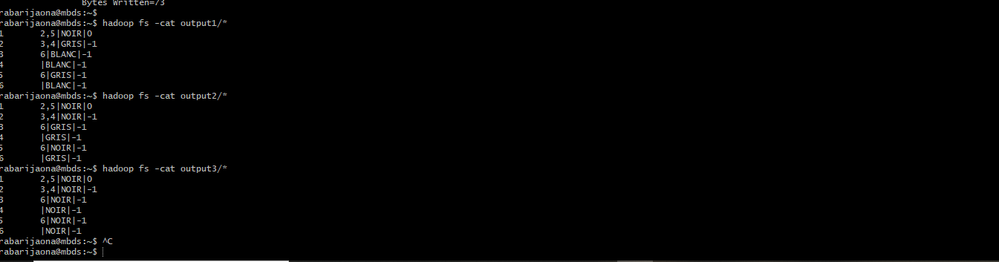

# Exercice 4 – Graph Breadth-First Search (BFS)

## Objectif
Implémenter l’algorithme de **parcours en largeur (BFS)** sur un graphe distribué avec Hadoop MapReduce.  
Le programme doit être exécuté **plusieurs fois** : chaque sortie devient l’entrée suivante, jusqu’à ce que tous les nœuds soient marqués **NOIR** (condition d’arrêt).

---

## Fichier d’entrée
Nom : `graph_input.txt`  
Format : une paire `clé \t valeur` par ligne.  
Exemple :
```
1    2,5|GRIS|0
2    3,4|BLANC|-1
3    6|BLANC|-1
4    |BLANC|-1
5    6|BLANC|-1
6    |BLANC|-1
```

- **Clé** : identifiant du nœud.  
- **Valeur** : voisins|couleur|distance.  
  - Couleur : BLANC (non visité), GRIS (en cours), NOIR (terminé).  
  - Distance : nombre d’arêtes depuis la source (ou -1 si non atteint).

---

## Étapes de mise en place

### 1. Copier le fichier sur la VM
```bash
cp /vagrant/tp/2/graph_input.txt .
```

### 2. Mettre le fichier dans HDFS
```bash
hadoop fs -put graph_input.txt .
hadoop fs -ls
```

### 3. Compilation du projet
Sur ton PC :
```bash
mvn clean package
scp target/graph-bfs-1.0-SNAPSHOT.jar rabarijaona@spark.aiaoma.com:~
```

---

## Exécution du BFS

### Première itération
```bash
hadoop jar graph-bfs-1.0-SNAPSHOT.jar org.mbds.GraphDriver graph_input.txt output1
hadoop fs -cat output1/*
```

Résultat :
```
1    2,5|NOIR|0
2    3,4|GRIS|-1
3    6|BLANC|-1
4    |BLANC|-1
5    6|GRIS|-1
6    |BLANC|-1
```

### Deuxième itération
```bash
hadoop jar graph-bfs-1.0-SNAPSHOT.jar org.mbds.GraphDriver output1 output2
hadoop fs -cat output2/*
```

Résultat :
```
1    2,5|NOIR|0
2    3,4|NOIR|-1
3    6|GRIS|-1
4    |GRIS|-1
5    6|NOIR|-1
6    |GRIS|-1
```

### Troisième itération
```bash
hadoop jar graph-bfs-1.0-SNAPSHOT.jar org.mbds.GraphDriver output2 output3
hadoop fs -cat output3/*
```

Résultat final :
```
1    2,5|NOIR|0
2    3,4|NOIR|-1
3    6|NOIR|-1
4    |NOIR|-1
5    6|NOIR|-1
6    |NOIR|-1
```

---

## Résultat attendu
- Tous les nœuds sont **NOIR** → BFS terminé.  
- Les distances sont correctement propagées depuis la source.  
- Chaque étape intermédiaire (`output1`, `output2`, `output3`) montre la progression du BFS.

---

## Tests et résultats:
-  

---

## Conclusion
Cet exercice démontre :
- L’utilisation de **KeyValueTextInputFormat** pour lire des paires clé/valeur.  
- La propagation itérative du BFS avec Hadoop MapReduce.  
- La gestion des états des nœuds (BLANC → GRIS → NOIR).  
- La condition d’arrêt : plus aucun nœud GRIS.

