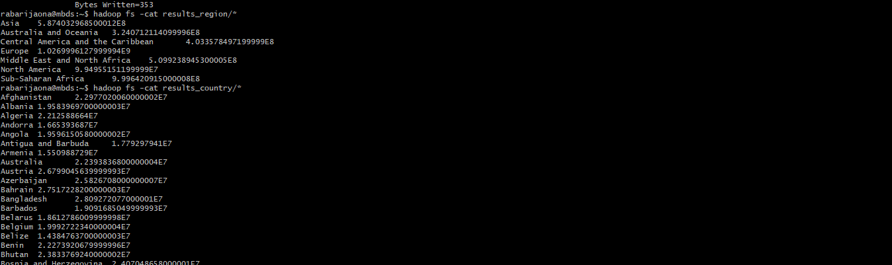
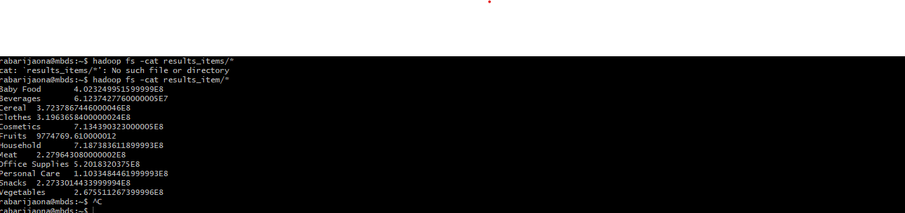

# Exercice 3 – Sales Analysis (Hadoop MapReduce)

## Objectif
Développer une application Hadoop MapReduce capable d’analyser un fichier CSV de ventes (`sales_world_10k.csv`) et de calculer le **profit total** selon différents critères :
1. Par **région** (`Region`)
2. Par **pays** (`Country`)
3. Par **type d’article** (`Item Type`)

Le programme doit être **paramétrable** : le comportement est choisi via un argument en ligne de commande.

---

## Fichier d’entrée
- Nom : `sales_world_10k.csv`
- Format : CSV avec en-tête
- Colonnes utilisées :
  - `Region`
  - `Country`
  - `Item Type`
  - `Total Profit`

La première ligne (header) doit être ignorée dans le Mapper.

---

##  Étapes de mise en place

### 1. Copier le fichier sur la VM
```bash
cp /vagrant/tp/1/sales_world_10k.csv .
```

### 2. Mettre le fichier dans HDFS
```bash
hadoop fs -put sales_world_10k.csv .
hadoop fs -ls
```

### 3. Compilation du projet
Sur ton PC :
```bash
mvn clean package
```

Transfert du `.jar` vers la VM :
```bash
scp target/sales-1.0-SNAPSHOT.jar rabarijaona@spark.aiaoma.com:~
```

---

## Exécution du programme

### Par région
```bash
hadoop jar sales-1.0-SNAPSHOT.jar org.mbds.SalesDriver region sales_world_10k.csv results_region
```

### Par pays
```bash
hadoop jar sales-1.0-SNAPSHOT.jar org.mbds.SalesDriver country sales_world_10k.csv results_country
```

### Par type d’article
```bash
hadoop jar sales-1.0-SNAPSHOT.jar org.mbds.SalesDriver item sales_world_10k.csv results_item
```

---

##  Résultats
Les résultats sont stockés dans HDFS dans les dossiers `results_region`, `results_country`, `results_item`.

Pour les afficher :
```bash
hadoop fs -cat results_region/*
hadoop fs -cat results_country/*
hadoop fs -cat results_item/*
```

Exemple de sortie :
```
Asia    1234567.89
Europe  987654.32
```

---

## Tests et résultats:
-  
-  

---

## Conclusion
Ce projet démontre :
- La lecture et le traitement d’un fichier CSV avec Hadoop MapReduce.
- L’utilisation de la **Configuration** pour rendre le programme paramétrable.
- La capacité à calculer des agrégats (somme des profits) selon différents critères.

