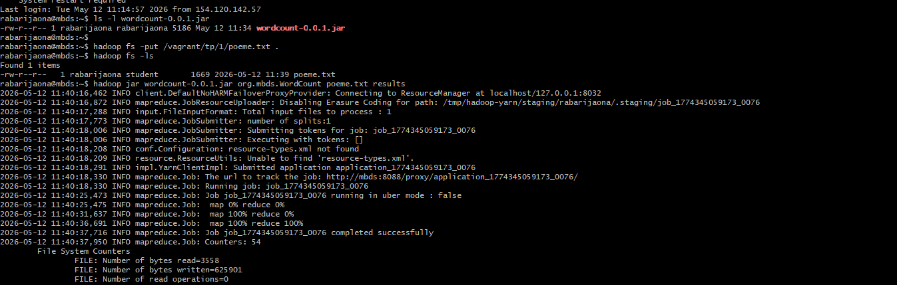

# README – Exercice 1 : WordCount avec Hadoop

## Objectifs
- Compiler un projet Java Maven pour générer un `.jar` contenant l’algorithme WordCount.  
- Transférer ce `.jar` sur la VM Hadoop.  
- Mettre un fichier texte (`poeme.txt`) dans HDFS.  
- Exécuter le job Hadoop pour compter les occurrences des mots.  
- Vérifier les résultats dans HDFS.

---

## Étapes détaillées

### 1. Compilation du projet (sur le PC)
Dans **Git Bash** sur ton PC :
```bash
mvn package
```
-> Cela génère le fichier `wordcount-0.0.1.jar` dans le dossier `target/`.

---

### 2. Transfert du `.jar` vers la VM
Toujours sur ton PC (Git Bash) :
```bash
scp target/wordcount-0.0.1.jar rabarijaona@spark.aiaoma.com:~
```
-> Ici, nous avons envoyé le `.jar` dans le **home directory de ton compte `rabarijaona` sur la VM**.

---

### 3. Connexion à la VM
Depuis ton PC :
```bash
ssh rabarijaona@spark.aiaoma.com
```
-> On arrive dans `/home/rabarijaona` sur la VM. C’est là que l'on exécute les commandes Hadoop.

---

### 4. Vérification du `.jar` sur la VM
```bash
ls -l wordcount-0.0.1.jar
```
-> Confirme que le fichier est bien présent dans ton répertoire personnel.

---

### 5. Mise en HDFS du fichier d’entrée
Toujours sur la VM :
```bash
hadoop fs -put /vagrant/tp/1/poeme.txt .
hadoop fs -ls
```
-> Cela copie `poeme.txt` dans HDFS et liste les fichiers présents.

---

### 6. Exécution du job Hadoop
```bash
hadoop jar wordcount-0.0.1.jar org.mbds.WordCount poeme.txt results
```
-> Ici, nous avons lancé le job WordCount :
- **Input** : `poeme.txt` (dans HDFS)  
- **Output** : `results` (répertoire créé dans HDFS)  

---

### 7. Vérification des résultats
```bash
hadoop fs -ls results
hadoop fs -cat results/*
```
-> Cela affiche les mots du poème avec leur nombre d’occurrences.

---

## Explication des commandes
- `mvn package` → compile le projet Java et génère le `.jar`.  
- `scp ...` → transfert du `.jar` depuis le PC vers la VM.  
- `ssh ...` → connexion à la VM en tant que `rabarijaona`.  
- `ls -l` → vérifie la présence du fichier dans le répertoire personnel.  
- `hadoop fs -put` → copie un fichier local vers HDFS.  
- `hadoop fs -ls` → liste les fichiers dans HDFS.  
- `hadoop jar ...` → exécute un programme MapReduce sur Hadoop.  
- `hadoop fs -cat` → lit le contenu d’un fichier dans HDFS.  

---
## Tests et résultats:
 
 

---
## Conclusion
Durant l’exercice 1, nous avons :
- Travaillé **localement sur le PC** pour compiler et transférer le `.jar`.  
- Travaillé **sur la VM (compte `rabarijaona`)** pour exécuter les commandes Hadoop.  
- Vérifié que le job s’est terminé avec succès et que les résultats sont bien présents dans HDFS.  

-> L’objectif de l’exercice est atteint : nous avons exécuté un job Hadoop WordCount et obtenu les occurrences des mots du fichier `poeme.txt`.

---